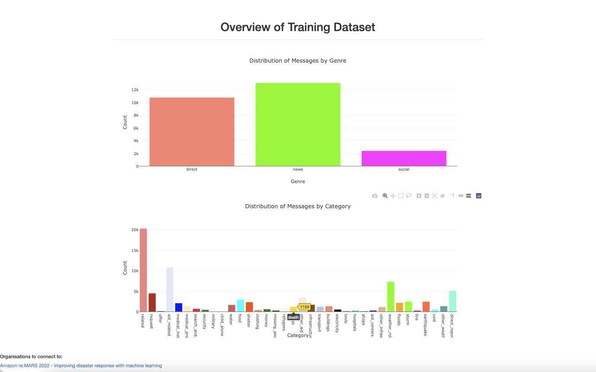
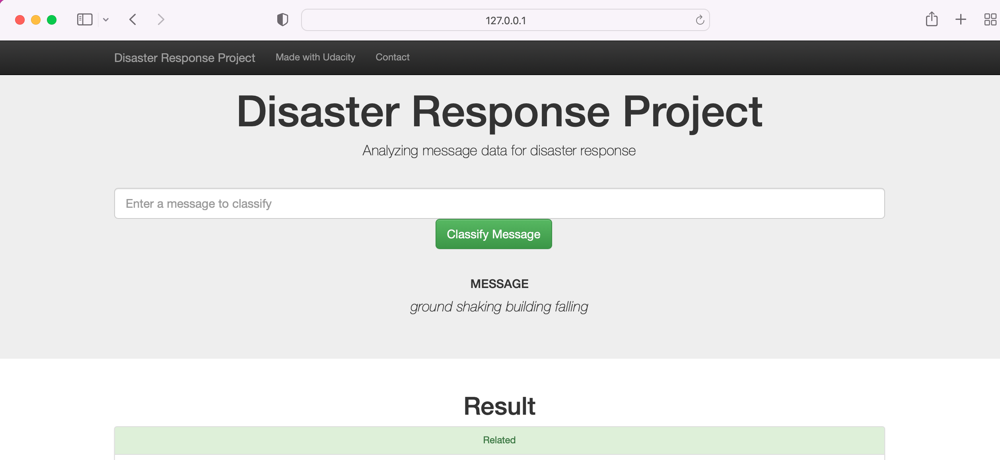

# Data Engineering for Data Scientists 

## Table of Contents
 * [Installations](#installations)
 * [Summary of Project](#summary-of-project)
 * [Project Structure](#project-structure)
 * [Files](#files)
 * [How To Run Python Scripts](#how-to-run-python-scripts)
 * [Acknowledgements](#acknowledgements)
 * [Future Work](#future-work)
 

## **Installations**

 sqlite3 · pickle · pandas · sys · sklearn · nltk · sqlalchemy · flask · json · plotly · re · numpy · joblib


## **Summary of Project**
#### Disaster Response Pipeline 
This project analyses thousands of real messages provided by Appen (previously known as Figure8) that were sent during natural disasters either via social media or directly to disaster response organisations. An ETL pipeline has been built to process message and category data from CSV files which are then loaded into a SQL database. A ML pipeline is created to read from the database and save a multi-output supervised learning model. 
 
The web app will extract data from this database to provide data visualisation and uses the model to classify new messages for the 36 categories. 
 
Machine learning is critical to helping different organisations understand which messages are relevant to them, and which messages to prioritise when a disaster occurs. During a disaster is when there is minimum capacity to filter out messages that matter and find basic messages (using keywords searches) to provide trivial results.

## **Project Structure** 

1. **ETL Pipeline**
A Python script, `process_data.py`, writes a data cleaning pipeline that:

- Loads the file paths of the two datasets
- Cleans the datasets
- Merges the messages and categories datasets
- Stores the clean data into a SQLite database
 
 A jupyter notebook `ETL Pipeline Preparation` was used to do EDA to prepare the process_data.py python script. 
 
2. **ML Pipeline**
A Python script, `train_classifier.py`, writes a machine learning pipeline that:

- Loads data from the SQLite database
- The script uses NLP techniques with a nltk-based function to process text data. 
- Splits the dataset into training and test sets 
- GridSearchCV is used to find the best parameters for the model. 
- The f1 score, precision and recall for the test set is outputted for each category.
- Stores the final model (classifier) into a pickle file
 
A jupyter notebook `ML Pipeline Preparation` was used to do EDA to prepare the train_classifier.py python script. 

3. **Flask Web App**
The web app, run.py, displays visualisations that describe the training data. 
Type text into the app, and this will return classification results for all 36 categories related to the input message.
 

## **Files**

```bash
├── data:
   └── process_data.py #file contain the script to create ETL pipeline 
   └── disaster_categories.csv # data to process
   └── disaster_messages.csv # data to process  
  
├── ETL-Pipeline-Peparation:
   └── ETL Pipeline Preparation.ipynb #initial template for experimentation of code
   └── DisasterResponse.db

├── ML-Pipeline-Peparation:
      └──  classifer.pkl #this will be produced once the pipeline is excecuted 
      └── ML Pipeline Preparation.ipynb #initial template for experimentation of code 
      
├── models:
      └── train_classifier.py #file contain the script to create ML pipeline
      
├── app:
    │ └── templates
    │  ├── go.html
    │  ├── master.html
    │  
    └── run.py
```


      
 ## **How To Run Python Scripts**

1. Run the following commands in the project's root directory to set up your database and model.

    - To run ETL pipeline that cleans data and stores in database
        `python data/process_data.py data/disaster_messages.csv data/disaster_categories.csv data/DisasterResponse.db`
    - To run ML pipeline that trains classifier and saves
        `python models/train_classifier.py data/DisasterResponse.db models/classifier.pkl`

2. Go to `app` directory: `cd app`

3. Run your web app: `python run.py`

4. Click http://0.0.0.0:3001 to open the homepage

http://disaster-response-app.s3-website.eu-west-2.amazonaws.com 

## **Acknowledgements**

* [Udacity](https://www.udacity.com/) for the web app starter code
* [Appen](https://appen.com/) for providing the relevant dataset to train the model 


## **Future Work**

How to deal with imbalanced data: 
-	Use a confusion matrix to see if rare cases are correctly classified. 
-	Collect more data. 
-	If the results are bad, use up-sampling or down-sampling or weights to put more emphasis on the rare cases.
-	Under-sample or down-scale.
-	Over-sampling or up-scaling. 
-	Combine under-sampling with over-sampling to get more balanced data set; combine both techniques to get a dataset that's closer to 50/50.
-	Assign each observation a weight.
-	Try different methods. 






